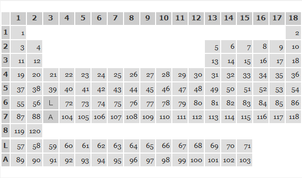

# 概要
下の図にある表の中で、与えられたy座標、x座標に対応するマスにある文字列を返す

# 入出力
## 入力
* コンマ区切りの y,x
* yは1～8の整数、或いは英字1文字で L もしくは A
* xは1～18

## 出力

* マスにある文字列を出力する
* ただし、空のマスの場合は - を出力する
* 空でないマスは殆ど数字だが、座標(6,3),(7,3)はそうでないことに注意

